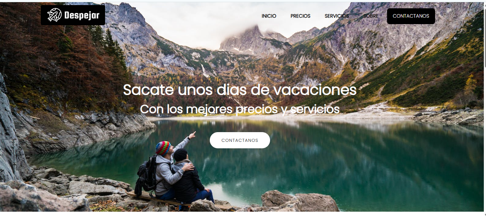

# ✈️ Despejar - Travel Agency

Multi-page website for a travel agency, featuring Home, Pricing, Services, About and Contact pages, a responsive menu, and styles organized with SASS.

🔗 **Live demo:** [add the link here after publishing on GitHub Pages]


<!-- Replace with a real screenshot of the homepage -->

---

## 🇬🇧 English

### About the project
A multi-page website for a fictional travel agency, featuring a services overview, pricing table, an "About" section, and a working contact form. The menu adapts to mobile with an animated slide-in hamburger menu.

### Features
- Navigation across 5 pages (Home, Pricing, Services, About, Contact)
- Responsive menu with animated open/close on mobile
- Customer testimonials section with star ratings
- Contact form integrated with [Formspree](https://formspree.io/) (works without needing your own backend)
- Layout built with HTML, CSS and SASS (organized into per-page partials)

### Tech stack
- HTML5
- CSS3 / SASS
- JavaScript (Vanilla, for the mobile menu)
- Font Awesome (icons)
- Formspree (form submission)

### Running locally
```bash
git clone https://github.com/GabriellyFerreiraa/despejar.git
cd despejar
```
Then simply open `index.html` in your browser.

---

## 🇪🇸 Español

### Sobre el proyecto
Sitio de varias páginas para una agencia de viajes, con presentación de servicios, tabla de precios, sección "Sobre nosotros" y formulario de contacto funcional. El menú se adapta a celular con un menú deslizante (hamburguesa).

### Funcionalidades
- Navegación entre 5 páginas (Inicio, Precios, Servicios, Sobre, Contacto)
- Menú responsive con apertura/cierre animado en mobile
- Sección de comentarios de clientes con calificación por estrellas
- Formulario de contacto integrado con [Formspree](https://formspree.io/) (funciona sin necesidad de servidor propio)
- Diseño construido con HTML, CSS y SASS (organizado en archivos parciales por página)

### Tecnologías utilizadas
- HTML5
- CSS3 / SASS
- JavaScript (Vanilla, para el menú mobile)
- Font Awesome (íconos)
- Formspree (envío de formulario)

### Cómo ejecutar localmente
```bash
git clone https://github.com/GabriellyFerreiraa/despejar.git
cd despejar
```
Luego solo hay que abrir el archivo `index.html` en el navegador.

---

## 🇧🇷 Português

### Sobre o projeto
Site de várias páginas para uma agência de viagens, com apresentação de serviços, tabela de preços, seção "Sobre" e formulário de contato funcional. O menu se adapta para celular com um menu deslizante (hambúrguer).

### Funcionalidades
- Navegação entre 5 páginas (Início, Preços, Serviços, Sobre, Contato)
- Menu responsivo com abertura/fechamento animado no mobile
- Seção de depoimentos de clientes com avaliação por estrelas
- Formulário de contato integrado com [Formspree](https://formspree.io/) (funciona sem precisar de servidor próprio)
- Layout construído com HTML, CSS e SASS (organizado em arquivos parciais por página)

### Tecnologias utilizadas
- HTML5
- CSS3 / SASS
- JavaScript (Vanilla, para o menu mobile)
- Font Awesome (ícones)
- Formspree (envio de formulário)

### Como rodar localmente
```bash
git clone https://github.com/GabriellyFerreiraa/despejar.git
cd despejar
```
Depois é só abrir o arquivo `index.html` no navegador.

---

## 👩‍💻 Author / Autora

**Gabrielly Ferreira**
📫 gabiferreira101@gmail.com
🔗 [LinkedIn](https://www.linkedin.com/in/gabrielly-ferreira-619609113/)
